# Restaurant Loader Challenge

Thank you for taking the time to complete our take-home code challenge. We appreciate it!

## Overview

You're building a progressive restaurant discovery page that loads data from an external API. Rather than waiting for all data to load, we want to stream results to the user as they become available.

**Time limit:** 30-45 minutes

**What we're testing:** Concurrency control, streaming responses, progressive UI updates, and code quality.

**What we're looking for:** Commits that show planning. If the bulk of your CSS is in one early commit, it shows you planned your layout and components first.

**PLEASE:** Read through all the instructions and plan your approach before you start. As you work through your plan, commit after every meaningful code change with detailed commit messages. To be honest, AI will produce the best result **IF** your prompts are well-worded and well-planned. Please take note of your prompts and include them in the submission.

---

## Getting Started

### 1. Create Your Own GitHub Repository

**Option A: Use Template (Recommended)**

1. Go to https://github.com/gwest7/candidate-test
2. Click the green **"Use this template"** button
3. Choose:
   - **Owner:** Your GitHub account
   - **Repository name:** `restaurant-loader-challenge` (or your choice)
   - **Visibility:** Public OR Private
4. Click **"Create repository from template"**

**Option B: Manual Clone**

```bash
# Clone the base repo
git clone https://github.com/gwest7/candidate-test.git restaurant-loader-challenge
cd restaurant-loader-challenge

# Remove the original remote
git remote remove origin

# Create a new repo on your GitHub account, then:
git remote add origin https://github.com/YOUR-USERNAME/restaurant-loader-challenge.git
git push -u origin main
```

### 2. Clone and Setup Your Repo

```bash
# Clone YOUR repository
git clone https://github.com/YOUR-USERNAME/restaurant-loader-challenge.git
cd restaurant-loader-challenge

# Install dependencies
npm install

# Start development
npm run dev
```

The app should start with:
- Server on `http://localhost:3000`
- Client with hot reload

### 3. Explore the Example

Visit `http://localhost:3000` and click "Start Stream"

This demonstrates the **chunked JSON streaming pattern** you'll use. Check:
- **Server:** `src/server/index.ts` - `/api/stream` endpoint
- **Client:** `src/client/main.ts` - how to consume the stream

---

## Your Task

### Part 1: Progressive Restaurant Loader (Core Task)

**Create a new endpoint:** `GET /api/restaurants/stream`

**Requirements:**

1. **Import all restaurants** from `restaurants.ts`
   - These restaurant names should form the base of the HTML table
   - Getting it to the client is part of the problem

2. **Fetch details** for each restaurant using `fetchRestaurantDetails(id)` from `api.ts`

3. **Limit concurrency** to 5 simultaneous API calls
   - Don't fetch all 134 at once (will overload the API)
   - Don't fetch one-by-one (too slow)
   - Keep exactly 5 active requests at any time
   - Create a separate module for this

4. **Stream updates** to the client
   - Don't wait for all to finish before responding
   - Send each restaurant update when it arrives

5. **Update the client** (`src/client/main.ts`)
   - Call your new `/api/restaurants/stream` endpoint
   - Display restaurant updates as they arrive (progressive rendering)
   - Show real-time loading progress using the total and number completed
   - Update the DOM incrementally, not in batches

**Acceptance Criteria:**

✅ Endpoint streams restaurant data progressively  
✅ Never more than 5 concurrent API requests  
✅ Client displays/updates restaurants as they arrive  
✅ Progress indicator updates in real-time  
✅ All 134 restaurants' details eventually load (or show errors)  
✅ Handles API failures gracefully (some requests may fail, especially outside business hours)

---

### Part 2: Bonus - Menu Loading (If Time Permits)

Extend your loader to also fetch restaurant menus:

1. Add the fetching of each restaurant's menu
2. Use `fetchRestaurantMenu(id)` from `api.ts`
3. Send an update down the same stream
4. Update the restaurant's UI to show menu info

**Constraints:**
- Still maintain the 5 concurrent request limit (shared between details and menus)
- Handle menu fetch failures independently (don't break the whole stream)

---

Here is a diagram to help you visualise the flow of data.

```mermaid
sequenceDiagram
participant DOM as Page DOM
participant C as Client JS
participant S as Server JS
participant MrD as mrdfood.com

C->>S: onclick → GET /api/stream/restaurants
S-->>C: Initial list of restaurants
C->>DOM: Create restaurant elements

loop Restaurants — limited concurrency
   S->>MrD: Fetch restaurant details
   MrD-->>S: RestaurantDetails
   S-->>C: Stream JSON chunk
   C->>DOM: Update restaurant element
end

Note over S:  Part 2: All restaurant details received.<br/>Begin processing queued menu requests.

loop Menus — limited concurrency
   S->>MrD: Fetch menu by id
   MrD-->>S: Menu
   S-->>C: Stream JSON chunk
   C->>DOM: Update restaurant element
end

S-->>C: End response stream
```




---

## What We're Evaluating

### Code Quality
- ✅ **Organization:** Is logic clearly separated? Are functions lean and focused?
- ✅ **TypeScript:** Are types used properly? Avoid `any`
- ✅ **Readability:** Can another developer understand your code?
- ✅ **Comments:** Do you explain non-obvious decisions?

### Technical Skill
- ✅ **Concurrency control:** Do you properly limit simultaneous requests?
- ✅ **Streaming:** Do results appear progressively or in batches?
- ✅ **Error handling:** What happens when API calls fail?
- ✅ **Testing:** Is the loader easily testable with automation?

### Process
- ✅ **Commits:** Do they show your thought process?
- ✅ **Prioritization:** Did you get basics working before attempting bonus?
- ✅ **Time management:** Working solution in 30-45 minutes?
- ✅ **LLM:** How well are your prompts (if supplied) worded?

---

## Important Constraints

⏱️ **Time-boxed:** Aim for 30-45 minutes total
📝 **Commit frequently:** We'll review your git history
⚠️ **External API:** The API is slow and occasionally returns errors
✅ **Working > Perfect:** We value a simple working solution over incomplete perfection

---

## Submission

When you're done (or time is up):

### 1. Make sure it compiles and runs

Please `npm run build && npm run start` to make sure it runs

### 2. Final remarks

Please edit `FINAL.md` and add any information you feel like.

### 3. Push Your Code

Make sure you do not have any untracked or uncommitted files. Make sure all your commits are pushed to `origin`.

### 4. Let us have a look

Add `gwest7` as a collaborator. The email from GitHub will be our ping.

- Go to Settings → Collaborators → Add `gwest7`


---

## AI

Here is what very specific LLM prompts produced: https://youtu.be/nluEqXetQLs and https://youtu.be/hn_HUOyS6mk

---

## Questions?

**Unclear requirements?** Make a reasonable assumption and document it in your submission notes.

**API not working?** Let us know in your submission - we can verify and review our access logs. Depending on the time of day, some endpoints will respond negatively.

**Running out of time?** Submit what you have! We value working basics over incomplete advanced features.

---

## Good Luck! 🚀

Remember:
- ⏱️ 30-45 minutes total
- 📝 Commit as you go
- 💬 Comment your code
- ✅ Working > Perfect
- 🎯 Progressive loading is the key challenge

**We're excited to see your approach!**
